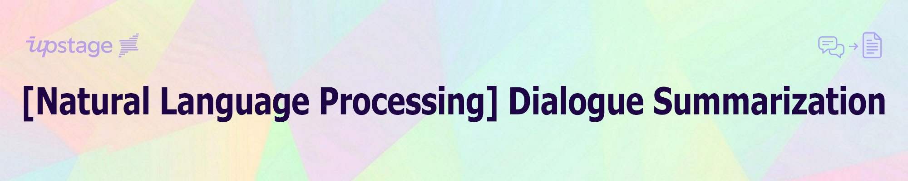

## **💻 Project Overview**
### Environment
- **OS:** Linux Ubuntu 20.04.6 LTS
- **GPU:** NVIDIA GeForce RTX 3090 (24GB)
- **NVIDIA Driver Version:** 535.86.10
- **CUDA Version:** 12.2 (Runtime: 12.1)
- **Tool:** VS Code (SSH)
- **Language:** Python 3.10.14
- **Prerequisites:** 한글 시각화를 위해 나눔 폰트 필요
```bash
apt update && apt install -y fonts-nanum
```

### Requirements
- accelerate==0.34.2
- bitsandbytes==0.45.0
- httpx==0.26.0
- ipykernel==7.2.0
- matplotlib==3.10.8
- openai==1.12.0
- pandas==2.3.3
- peft==0.12.0
- plotly==6.5.2
- python-dotenv==1.0.1
- rouge==1.0.1
- scikit-learn==1.7.2
- seaborn==0.13.2
- torch==2.4.1
- torchaudio==2.4.1
- torchvision==0.19.1
- transformers==4.46.1
- trl==0.12.1
- wandb==0.25.0
- wordcloud==1.9.6

---

## **📋 Competiton Info**
### DialogSum: A Real-life Scenario Dialogue Summarization (일상 대화 요약)
- 실제 일상생활(학교, 직장, 치료, 쇼핑, 여행 등)에서 가능한 다양한 시나리오 multi-turn 대화를 바탕으로 생성 요약문 작성
- 목표: 정확하고 일반화된 모델을 개발하여 요약문 생성
- 대화 스타일: 구어체 (최소 2명 ~ 최대 7명의 대화형식, 최소 2turn ~ 최대 60turn)
- 대화 도메인: 다양한 주제
- Senario: daily life

### 데이터셋 정보 (Dataset Info)
- 학습데이터: 12,457건
- 검증데이터: 499건
- 평가데이터: 499건
- 제출파일: 499건 (sample_submission.csv)
- 평가데이터는 학습데이터와 달리 dialogue 하나에 summary 3개 존재

### Feature 구성
- 학습데이터: fname (train_0부터), dialog, summary, topic
- 검증데이터: fname (dev_0부터), dialog, summary, topic
- 평가데이터: fname (test_0부터), dialog
- 제출파일: index (헤더명 없음, 0부터), fname, summary

### 정답 요약문 작성시 주요 기준
- 대화의 가장 중요한 정보를 전달
- 간략하게 (대화 길이의 20% 이내)
- 대화 내에서 중요한 명명된 개체를 보존 (사람 이름, 기업명 등)
- 관찰자의 관점에서 작성 (화자의 의도를 이해하고 작성)
- 은어나 약어 없이 공식적으로 사용되는 언어로 작성

### 규정 (Rule)
- DialogSum 데이터셋을 기반으로 한 모든 파생 데이터셋 및 파생 작업물 금지
- 무료로 사용 가능한 API에 한정하여 사용 가능 (Solar 모델은 사용 가능)

### 평가지표 (Evaluation Metric)
- ROUGE (Recall-Oriented Understudy for Gisting Evaluation)

}{N}&plus;\frac{\sum_{i}^{N}\text{ROUGE-2-F1}(\text{pred},\text{gold}_i)}{N}&plus;\frac{\sum_{i}^{N}\text{ROUGE-L-F1}(\text{pred},\text{gold}_i)}{N})

- Sentence Tokenization: 한국어 형태소 분석기를 통해 의미를 갖는 최소 단위인 형태소 단위로 문장을 쪼갠 뒤 모델이 생성한 문장과 정답 문장을 비교하여 ROUGE score 산출
- 3개의 summary에 대해서 개별적으로 점수를 산출한 뒤, 종합하여 최종 평가에 활용
- Metric 점수가 100점 만점이 아님 (3개의 정답 요약 문장 중 하나를 랜덤하게 선택하여 산출된 점수가 약 70점 정도)
- DialogSum 데이터셋은 Multi-Reference Dataset으로 multi-reference에 대한 average를 보는 것이 중요
- Public / Private은 대화 주제에 따라 50%씩 고르게 선정

---

## **⚙️ Components**
### Directory
```
├── archive/...                # legacy files (v1 ~ v5)
├── assets/...                 # README images & PDF
├── code/
│   ├── eda.ipynb              # EDA
│   ├── nlp_ds_v6_fail.py      # v6 (GroupKFold)
│   ├── nlp_ds_v6.py           # v6
│   ├── nlp_ds_v7_final.py     # v7 (final)
│   ├── solar_api_summary.py   # Solar API call (summary)
│   └── solar_api_topic.py     # Solar API call (topic)
├── config/                    # yaml file
│   ├── nlp_ds_v6.yaml         # 실행파일명과 동기화
│   └── nlp_ds_v7_final.yaml
├── data/                      # (이하 GitHub 관리안함)
│   ├── dev_solar.csv          # Solar API로 증강한 dev summary & topic
│   ├── dev.csv                # 검증데이터
│   ├── sample_submission.csv  # 제출파일 template
│   ├── test_solar.csv         # Solar API로 생성한 test topic
│   ├── test.csv               # 평가데이터
│   └── train.csv              # 학습데이터
├── experiments/               # (이하 GitHub 관리안함)
│   ├── checkpoint-####/...    # checkpoint directories
│   ├── logs/...               # WandB & logs
│   └── output.csv             # 추론 후 제출할 파일 생성
├── images/...                 # 시각화 images
├── .env                       # 경로설정
├── .gitignore
├── LICENSE
├── README.md
└── requirements.txt
```

---

## **💾 Data Description**
### EDA (Exploratory Data Analysis)
#### 1. 데이터의 구조적 무결성 검증
> 훈련데이터의 마지막 인덱스 번호(0-12459)와 안내된 건수(12457)가 불일치해 fname 누락 여부 검사<br>
> fname에서 숫자 추출하여 0부터 최댓값까지의 집합과 실제 데이터 집합 간의 차집합 연산을 훈련, 검증, 평가데이터에 모두 수행<br>
> 인덱스 결측치에 의한 불연속성 확인 (훈련 3건 [10933, 10972, 11473], 검증 1건 [475], 평가 1건 [466])

> 중복 대화 확인: 0건

#### 2. Qualitative Glimpse
> 비정형 데이터인 일상 대화지만 채팅 대화와 달리 약어나 이모지 없이 formal style을 가짐<br>
> 대화 중 이름 및 고유명사 표기가 영어와 한글이 섞여있음. Mr. Mrs. 등의 호칭도 자주 사용하나 '씨'와 일관성 없이 섞여있음.<br>
> 고유명사를 제외하면 기본적으로 한국어 대화이며, 다른 언어 대화는 없으나 DialogSum 원본이 영문이라 어색한 번역체<br>
> (아마도) 중국계 미국인이 만든 데이터셋이라 금액은 달러 또는 위안으로 표기. 달러는 $로도 표기됨 (역시 중구난방)

> 개인정보 마스킹 처리: 전화번호(#PhoneNumber#), 주소(#Address#), 생년월일(#DateOfBirth#), 여권번호(#PassportNumber#), 사회보장번호(#SSN#), 신용카드번호(#CardNumber#), 차량번호(#CarNumber#), 이메일주소(#Email#)

#### 3. Dialogue & Summary Inspection
> **대화문 길이 (학습):**  평균 406, 최소 84, 최대 2165<br>
> **대화문 길이 (검증):**  평균 400, 최소 114, 최대 1269<br>
> **대화문 길이 (평가):**  평균 419, 최소 111, 최대 2213

> **요약문 길이 (학습):**  평균 86, 최소 13, 최대 376<br>
> **요약문 길이 (검증):**  평균 81, 최소 29, 최대 283

> **대화문 토큰 길이 (학습):** 평균 152, 최소 32, 최대 918<br>
> **대화문 토큰 길이 (검증):** 평균 149, 최소 39, 최대 525<br>
> **대화문 토큰 길이 (평가):** 평균 155, 최소 40, 최대 879

> **요약문 토큰 길이 (학습):** 평균 13, 최소 6, 최대 156<br>
> **요약문 토큰 길이 (검증):** 평균 29, 최소 10, 최대 98

> **대화문 vs 요약문 토큰 상관계수**
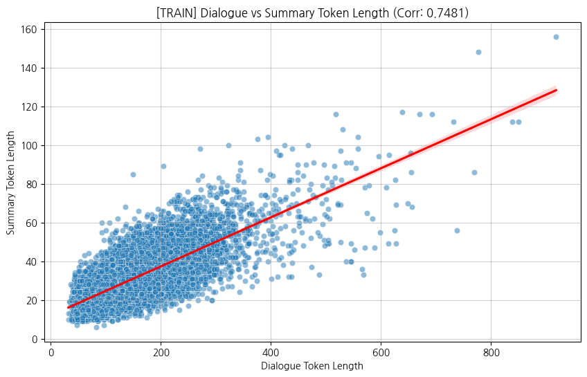
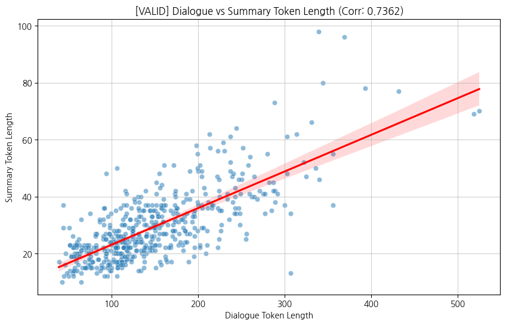

> **요약문 문장 수 통계**
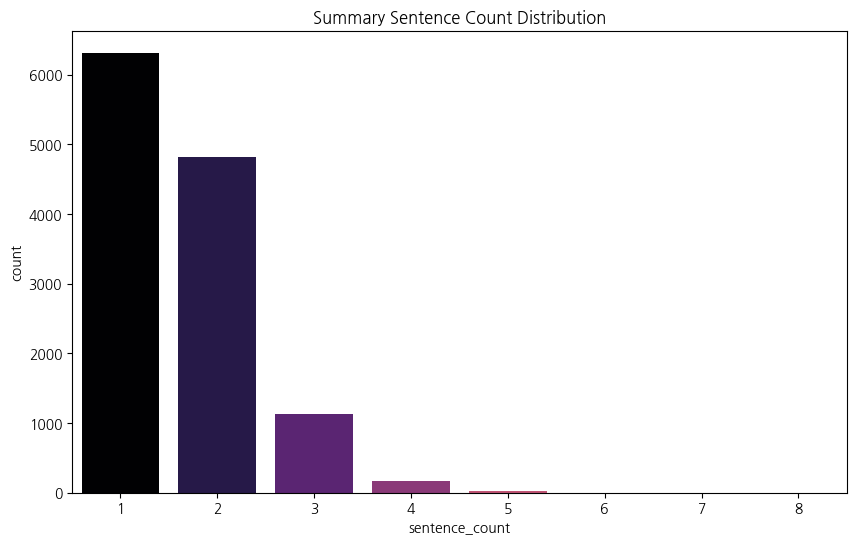

#### 4. Turn & 화자(speaker) 수
> 각각의 발화자를 구분하기 위해 #Person"N"#: 을 사용하며, 발화자의 대화가 끝나면 \n 으로 구분<br>
> 턴 변경시 줄바꿈 규칙 누락: 5건<br>
> 최소 턴수: 2 / 최대 턴수: 59

> **턴 수 vs 요약문 길이 분포**
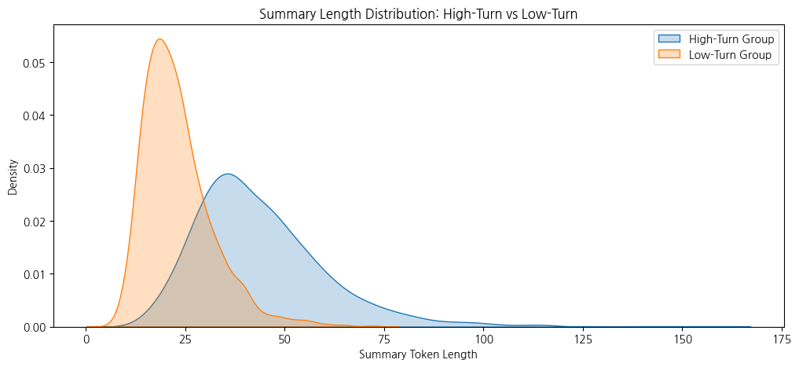

> **턴 수 vs 대화문 토큰 길이 상관계수 (학습)**
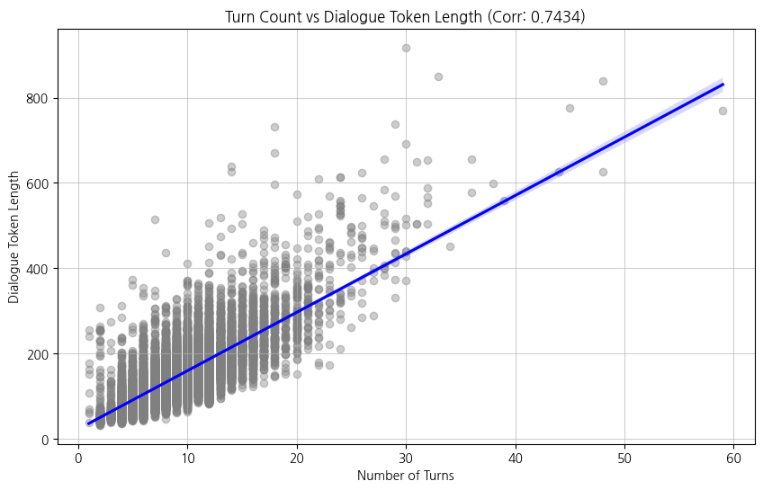

> **화자 수**<br>
> 학습: #Person1# 부터 #Person7# 까지 / 테스트: #Person1# 부터 #Person3# 까지<br>
> 대화당 등장인원 통계를 내보니 최대 참여인원 7명까진 훼이크고 대부분 둘이 주고받는 대화다..<br>
> 점점 통계 내는게 의미가 없는 기분이다. 😂
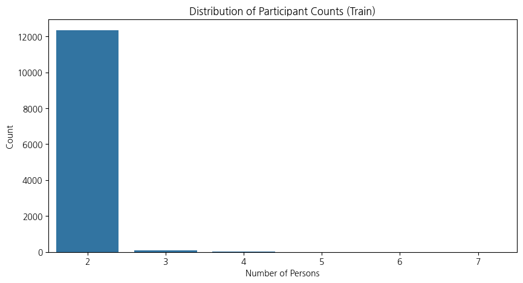

#### 5. Topic Inspection
> 전체 12,457건 대화 중 토픽이 (공백 정제 후에도) 9,235종에 달하는 분산 현상<br>
> Treemap 결과, 전체 토픽 종류 (9,235종) 대비 약 87% (8,041종), 전체 데이터 대비 약 64.5%가 1회성 토픽에 해당<br>
> Top 5: 음식 주문 (130), 취업 면접 (109), 길 안내 (66), 호텔 체크인 (40), 아파트 임대 (30)

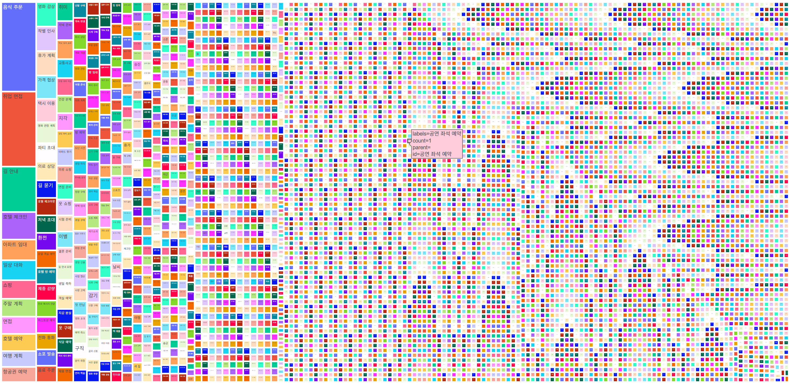

> 토픽 빈도수 분포로 시각화한 결과, 전형적인 long-tail 형태를 넘어 log를 적용해야 꼬리라도 보일 것 같다. 🫥<br>
> 다시 말해 토픽 분류에 의해 어떤 인사이트를 기대할 수 없다는 얘기다. 그래도 일단은 파본다.
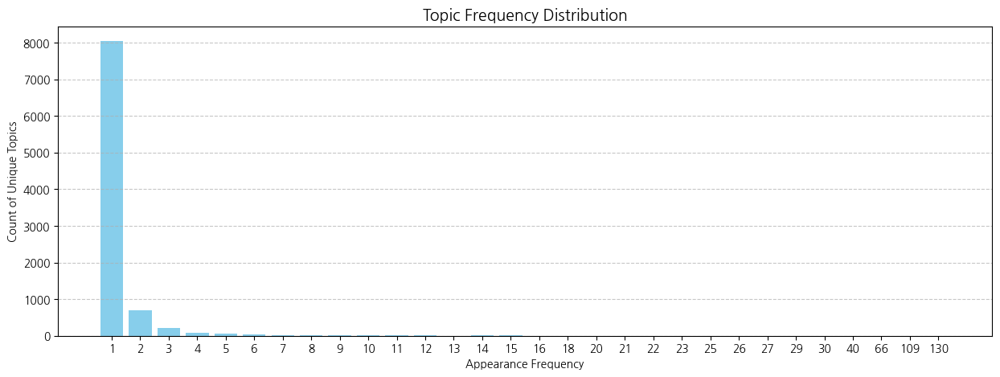

> 토픽이 너무 많아 토픽 대비 문자열 길이도 제대로 볼 수가 없다! (겹쳐서 시꺼먼게 전부 무한 토픽들..)
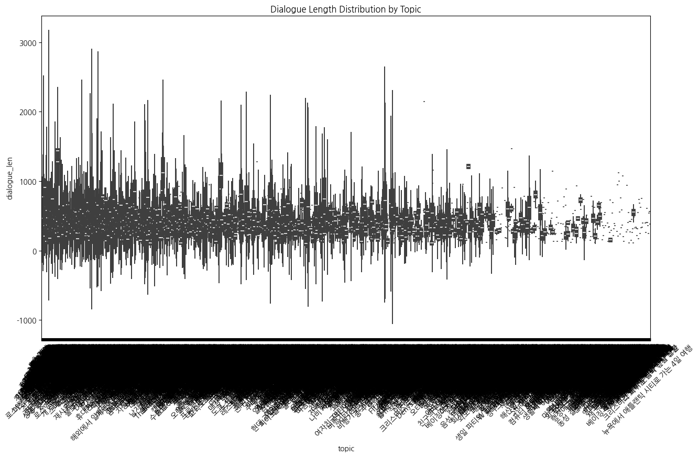

> 10건 이하 토픽을 그룹화하니 겨우 상황 파악 가능: 평균 406자, 최소 84자, 최대 2,165자<br>
> 근데 또 10건 이하 토픽이 문자열 긴 놈도 유난히 많아요. 이상치 점이 선이 되고 있다..
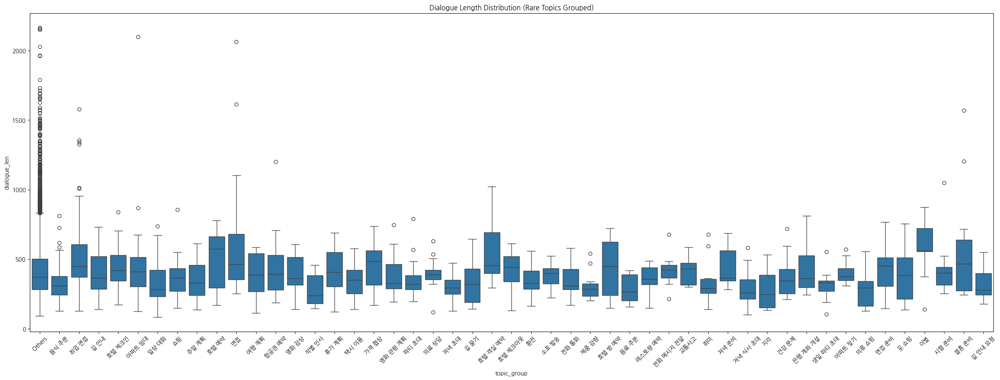

> 토픽별로 단어 빈도를 대략적으로 확인하기 위해 최다 토픽 5건에 대해 Word Clouds 시각화<br>
> 일반적이거나 의미없는 단어들은 간단한 불용어사전을 작성해 필터링하니 주제별로 키워드가 확실히 보인다.<br>
> (예약했어요 손님 방이 인상적이다.. 아-파트아파트아-파트 🎶)

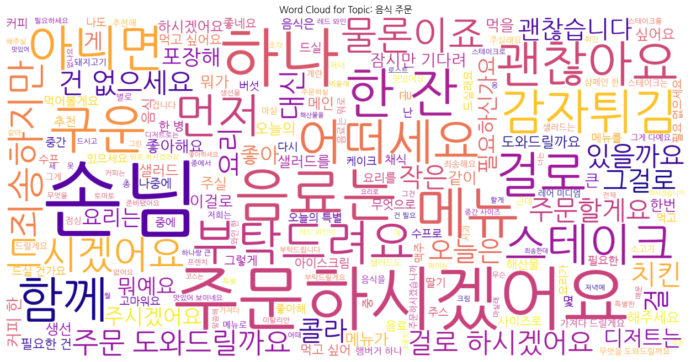
| Topic 2 | Topic 3 |
| :---: | :---: |
| 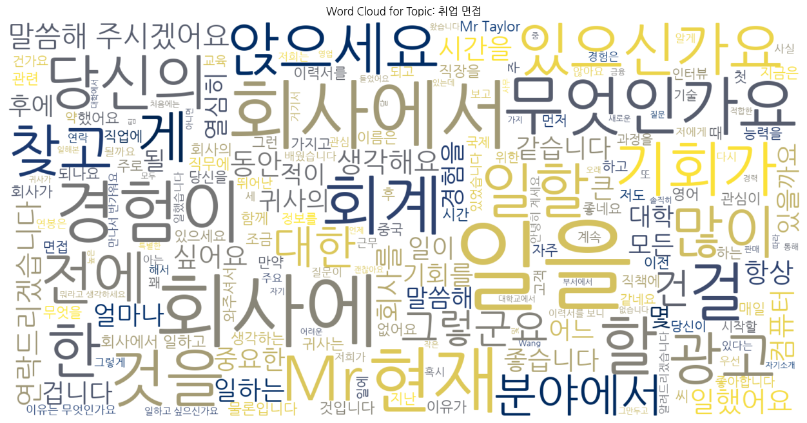 |  |
| **Topic 4** | **Topic 5** |
| 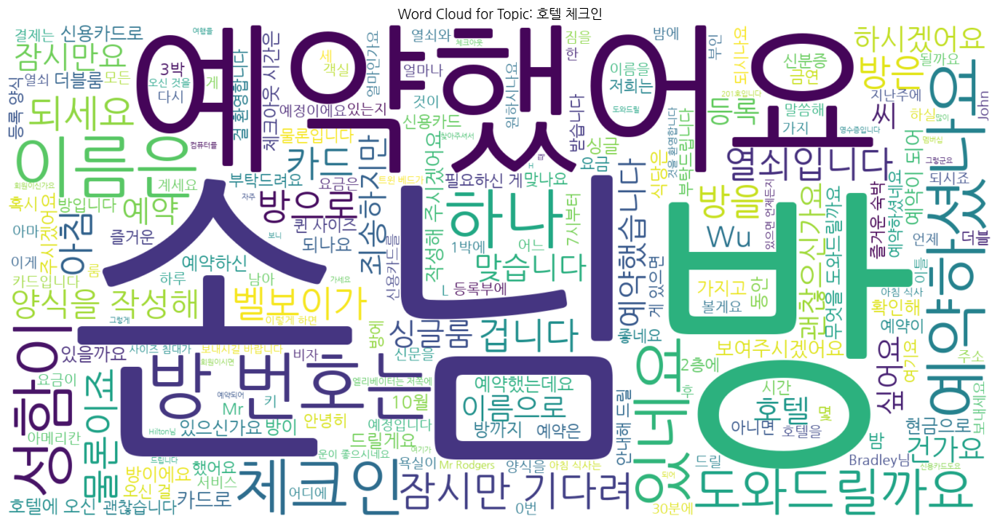 | 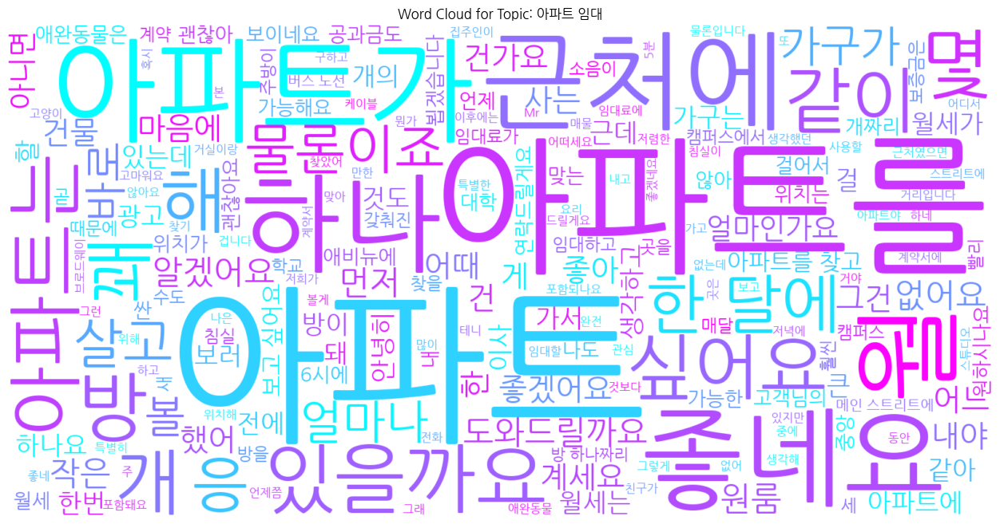 |

### Data Preprocessing
- test.csv와 submission의 index를 일치시키기 위해 left join 병합으로 dataframe mapping을 시도했으나, 이후 제출 파일 또한 평가 데이터와 동일한 인덱스가 누락됨을 발견, 만일을 위해 assert만 수행
- special_tokens에 화자를 #Person7#까지 모두 추가하고 마스킹된 개인정보 태그도 일괄 등록하여 embedding layer 일치
- data cleaning: 줄바꿈 누락 10건, 턴이 바뀌면 줄바꿈 되는 규칙 위반 5건, `\\n`와 같은 데이터 노이즈 전처리
- 대화문과 요약문간의 0.74대의 높은 상관관계 확인되어 25%, 50%, 75%를 분기점으로 대화문 길이에 따라 요약문 길이 제한

---

## **🧠 Modeling**
### Model Description
#### 1. KoBART (digit82/kobart-summarization)
- 파라미터: 약 1.2억 개(124M)
- 구조: Encoder-Decoder (Seq2Seq)
- 학습목표: 노이즈 복구 (Denoising)
- digit82: 정형화된 뉴스/문서 요약
- 단점: 문맥 유지 및 추론 능력이 부족하고 지시 수행에 한계

#### 2. Upstage Solar (yanolja/KoSOLAR-10.7B-v0.2) + QLoRA
- 파라미터: 107억 개 (10.7B)
- 구조: Decoder-only (Causal LM)
- 학습목표: 다음 토큰 예측 (Next Token Prediction)
- yanolja: Upstage 기술력 + 야놀자의 여행, 숙박 데이터로 학습시켜 한국어 문맥 파악 능력과 지시사항 이행 능력 우수
- 단점: LLM급 괴물 덩치라 1epoch 돌려보고 fine tuning 포기 (3090 기준 28시간..)

### Modeling Process
- full seed fixing (CUDA 결정론적 알고리즘 적용)
- 최대 문자열까지 안정적으로 담기 위해 encoder 1024, decoder 256 변경
- 일반화 성능을 향상하고 검증데이터를 증강에 활용하기 위해 K-Fold 적용
- hyper-parameter의 max_length는 토큰 개수이며 special token은 1토큰으로 처리됨을 확인,<br>
  요약문 길이 단위를 토큰으로 변경 후 3단계 길이 제한을 quantile 10%씩으로 세분화
- 문장 길이 관련 hyper-parameter를 조정하여 문장을 되도록 짧게 끝마치도록 유도 (length_penalty, repetition_penalty, early_stopping)
- 그래도 문장이 끊기는 경우 종결 문장 부호를 기준으로 정규식을 적용하여 제거
- ROUGE 중요도에 따라 MBR (Minimum Bayes Risk) 가중치 적용
- 문자열 길이가 75% 이상이 되면 급격히 늘어나므로 이상치로 간주, MBR 가중치 적용 후보군에서 제외
- Solar API 활용, 학습데이터처럼 topic 컬럼을 평가가데이터에도 생성, 모델이 topic을 통해 대화내용을 미리 추정하도록 유도

---

## **🕵️‍♀️ Hypothesis Testing**
#### 1. 요약문 스타일 통일
- **가설:** "~합니다." "~한다." "~함." 등의 불규칙한 동사 어미를 일치시키면 ROUGE가 오르지 않을까?
- **결과:** 동일 코드에 동사 어미만 변경시 리더보드 점수 오히려 하락

#### 2. 맞춤법 & 띄어쓰기 통일
- **가설:** 조사 '은/는'을 화자 태그 발음에 맞게 일관화 (예: #Person1#은), 화자 태그와 조사 사이에 생성되는 빈칸 정규식으로 제거
- **결과:** 리더보드 점수 여전히 하락, 그럼 GT에 일관성이 없다는건데.. 러시안룰렛이여?<br>
  데이터의 품질 검수가 제대로 이루어진 건지 의문

#### 3. 대화문 길이에 따른 요약문 길이 조정
- **가설:** 대화문에 비례하여 요약문도 길어진다면 요약문의 길이를 대화문 길이에 맞춰 제한을 두면 어떨까?
- **결과:** 상관계수 0.74로 가능성 있음, 통계 기반의 11단계 동적 길이 제어 후 리더보드 점수 상승

#### 4. ROUGE의 중요도에 따른 가중치 적용
- **가설:** ROUGE-2는 bigram이라 확률적으로 가장 점수 내기 힘들고 실제로도 매우 낮으므로 ROUGE-2가 높은 요약문에 가중치를 두면 어떨까?
- **결과:** ROUGE-2 > ROUGE-L > ROUGE-1 순으로 MBR 가중치 적용 후 리더보드 점수 퀀텀점프

#### 5. 평가데이터에 topic 생성
- **가설:** topic 컬럼은 학습과 검증데이터에 존재하지만 용도가 없다. 그렇다면 평가데이터에도 topic을 생성해 어떤 대화인지 모델에게 힌트를 주고 키워드로써 유도시켜 보면 어떨까?
- **결과:** Solar API로 학습데이터와 유사한 키워드 중심 topic을 생성하여 평가데이터에 추가, 리더보드 점수 상승

#### 6. 이외 매우 많으나 지면 관계로 생략

---

## **💡 Insights from Trial and Error**
#### nlp_ds_v1_baseline.py
- **증상:** code refectoring 후 검증 점수가 0.1940로 떨어짐
- **원인:** ROUGE 대신 ROUGE Score 라이브러리를 사용함
- **조치:** 운영진 평가 기준인 ROUGE 라이브러리의 동일 버전으로 원복
- **교훈:** 누가 요즘은 ROUGE 안쓰고 ROUGE Score 쓴다고 했냐! 둘은 평가 결과가 다르고 대회의 룰은 무조건 지킵시다.

#### nlp_ds_v1_yaml.py
- **증상:** 화자 태그(#Person#)가 &lt;unused68&gt; 같은 비정상 토큰과 깨진 한자(㗡)로 도배되어 있음
- **원인:** clean_up_tokenization_spaces=True 설정으로 인한 decoding sequence 왜곡 및 한자 생성
- **조치:** 해당 옵션 제거 및 정규표현식을 통한 비정상 토큰 후처리 로직 도입
- **교훈:** 한국어 특수 토큰 추가시 tokenizer의 자동 공백 정리 기능을 지양해야 함

#### 이하
- 데이터 결측치 있는 줄 알고 삽질함
- 라이브러리 궁합 맞추기: 모델을 올리니 필요한 라이브러리와 기존 torch가 궁합이 안 맞음, CU124, CU121인데 bitandbytes가 너무 높아서 3번 고침
일단 OOM 잡는데만도 한참 걸렸다. 하이퍼파라미터 계속 튜닝해서 한 8번만에 성공.
그래도 BART에서 길어야 40분 걸렸던 학습이 1에폭으로 줄였는데도 6시간 이상.
- 검증에는 형태소 분석기가 없어 로컬 점수와 리더보드 점수가 같이 움직이는지 정확한 correlation 확인 불가
- 모델을 변경하면서 시행착오가 엄청나서 계획해 둔 가설을 대부분 포기해야 했다. 파라미터가 107억개는 너무 큰 도박이었다. 저게 107억원이 아닌 이상 모험하지 마라.
- 데이터가 쓰레기일 때(Garbage In), 모델이 얼마나 고통받는가(Garbage Out): 나만 데이터클렌징 하면 뭐하나 ground truth가 오염됐는데ㅠ

---

## **📊 Experiment Logger**
<table>
  <thead>
    <tr>
      <th align="center">NO.</th>
      <th align="center">DATE</th>
      <th align="center">MODEL</th>
      <th align="center">KEY CHANGES</th>
      <th align="center">R1</th>
      <th align="center">R2</th>
      <th align="center">RL</th>
      <th align="center" colspan="2">SCORE</th>
    </tr>
  </thead>
  <tbody>
    <tr>
      <td align="center">08</td>
      <td align="center">260303</td>
      <td>KoBART(digit82)</td>
      <td>망함</td>
      <td align="center">0.3586</td>
      <td align="center">0.1555</td>
      <td align="center">0.2901</td>
      <td align="center">26.8082</td>
      <td align="center">F</td>
    </tr>
    <tr>
      <td align="center">07</td>
      <td align="center">260302</td>
      <td>KoSOLAR(yanolja)</td>
      <td>망함</td>
      <td align="center">0.3586</td>
      <td align="center">0.1555</td>
      <td align="center">0.2901</td>
      <td align="center">26.8082</td>
      <td align="center">F</td>
    </tr>
    <tr>
      <td align="center">06</td>
      <td align="center">260227</td>
      <td>V2:eda2</td>
      <td>아몰랑랑</td>
      <td align="center">0.4885</td>
      <td align="center">0.2913</td>
      <td align="center">0.3991</td>
      <td align="center">39.2972</td>
      <td align="center">F</td>
    </tr>
    <tr>
      <td align="center">05</td>
      <td align="center">260227</td>
      <td>KoBART(digit82)</td>
      <td>비정상 토큰 이슈 해결</td>
      <td align="center">0.5127</td>
      <td align="center">0.3229</td>
      <td align="center">0.4157</td>
      <td align="center">41.7098</td>
      <td align="center">S</td>
    </tr>
    <tr>
      <td align="center">04</td>
      <td align="center">260226</td>
      <td>KoBART(digit82)</td>
      <td>비정상 토큰 이슈 디버깅</td>
      <td align="center">0.3824</td>
      <td align="center">0.1746</td>
      <td align="center">0.3056</td>
      <td align="center">28.7529</td>
      <td align="center">S</td>
    </tr>
    <tr>
      <td align="center">03</td>
      <td align="center">260226</td>
      <td>KoBART(digit82)</td>
      <td>config 분리</td>
      <td align="center">0.2420</td>
      <td align="center">0.1469</td>
      <td align="center">0.1921</td>
      <td align="center">19.3655</td>
      <td align="center">F</td>
    </tr>
    <tr>
      <td align="center">02</td>
      <td align="center">260226</td>
      <td>KoBART(digit82)</td>
      <td>refactoring</td>
      <td align="center">0.5691</td>
      <td align="center">0.3760</td>
      <td align="center">0.4808</td>
      <td align="center">47.5295</td>
      <td align="center">S</td>
    </tr>
    <tr>
      <td align="center">01</td>
      <td align="center">260226</td>
      <td>KoBART(digit82)</td>
      <td>baseline code</td>
      <td align="center">0.5676</td>
      <td align="center">0.3737</td>
      <td align="center">0.4807</td>
      <td align="center">47.4018</td>
      <td align="center">S</td>
    </tr>
  </tbody>
</table>
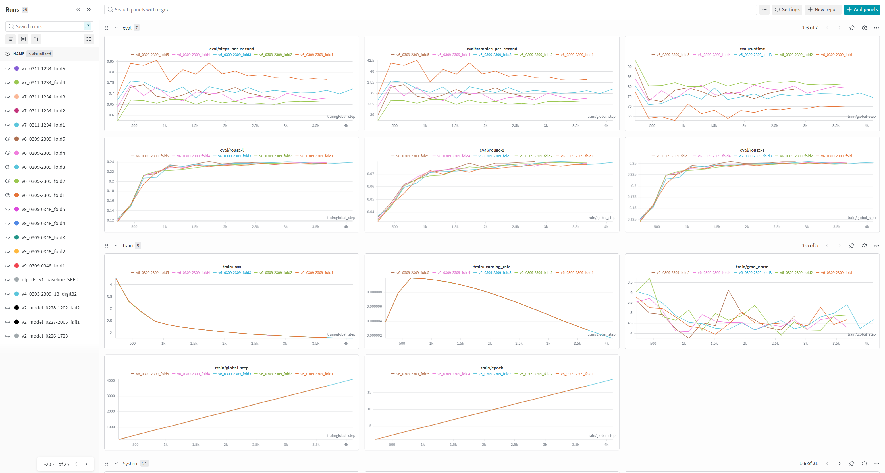

---

## **🚀 Result**
### Champion Model Info
- **Version:** V7 (KoBART)
- **Training Time:** 5h 30m (approx. 1h per fold)
- **Time per Epoch:** 3m 23s
- **Accuracy:** 49.2834

### Leaderboard Rank: No. 1 🏆


---

## **📜 Version Log**
### V1: digit82/kobart-summarization
> **nlp_ds_v1_baseline.py:**
- Jupyter Notebook을 Python script로 변환하며 발생하는 warnings & runtime errors 해결
- code formatting: PEP 8 적용
- code refactoring: 중복코드 제거 등
- 하드웨어 사양에 라이브러리 최적화
- 환경 설정: 데이터, 출력, 로그 경로 등

> **nlp_ds_v1_yaml.py:**
- config 설정값 .yaml 파일로 관리
- 명명된 개체 보존을 위해 학습데이터 기준으로 화자 수, 개인정보 마스킹 yaml에 모두 추가
- 실험명, 로그명, 환경파일명 등을 파일명, UTC와 동기화하여 자동화
- WandB로 checkpoint upload 중지
- hyperparameter 수정: batch size, gradient steps
- 데이터 로딩 방식 변경: on-the-fly tokenization
- tokenizer 공백 자동 정리 적용
- downgrade library versions

### V2: yanolja/KoSOLAR-10.7B-v0.2
> **nlp_ds_v2_eda.py:**
- 본격 EDA를 위해 Jupyter Notebook 파일로 분리
- tokenizer 공백 자동 정리 로직 제거 & 정규표현식 후처리
- model 중복 호출 제거
- WandB 로그 범위 확대
- 이후 Solar 10.7B 적용 과정에서 5일을 소모하고도 실험 완전 실패로 시간에 쫓겨 버전별 로그 작성 시간 확보 불가,<br>
  자세한 버전별 변경사항은 archive와 code 디렉토리 참조

---

## **🛠️ etc.**
### Reference
- [[GitHub] DialogSum: A Real-life Scenario Dialogue Summarization Dataset](https://github.com/cylnlp/dialogsum)
- [[arXiv] DialogSum: A Real-Life Scenario Dialogue Summarization Dataset (Chen et al., ACL 2021)](https://arxiv.org/abs/2105.06762)
- [[Kaggle] DialogSum Corpus: A Large-Scale Dataset for Dialogue Summarization and Topic Gen](https://www.kaggle.com/datasets/marawanxmamdouh/dialogsum/data)
- [[Hugging Face] KoSOLAR-10.7B-v0.2](https://huggingface.co/yanolja/KoSOLAR-10.7B-v0.2)
- [[Solar API] https://console.upstage.ai/api/chat](https://console.upstage.ai/api/chat)
- [[Optuna library] https://optuna.org/](https://optuna.org/)

### 프로젝트 회고
이번 대회는 아무리 논리적으로 합당한 가설을 시도해도 점수가 더 떨어지는 특이한 대회였는데요, 영어처럼 단어별로 띄어쓰기가 명확히 분리되지 않고 조사와 동사 어미 변화가 심한 한국어와 ROUGE 평가지표가 궁합이 맞지 않는게 첫번째 원인이 아니었나 싶습니다. 어쩌면 이 대회는 현실세계 데이터가 얼마나 지저분하고 종잡을 수 없는지, 언어라는게 얼마나 유동적이고 변칙적인지, 좋은 NLP 모델을 만드는게 얼마나 힘들고 수많은 랜덤 변수를 고려해야 하는지, 이론과 실제가 얼마나 다른지 그 실전의 쓴맛을 체험시켜 주는게 목적이었던 대회가 아니었나 싶습니다ㅠ
<br>
